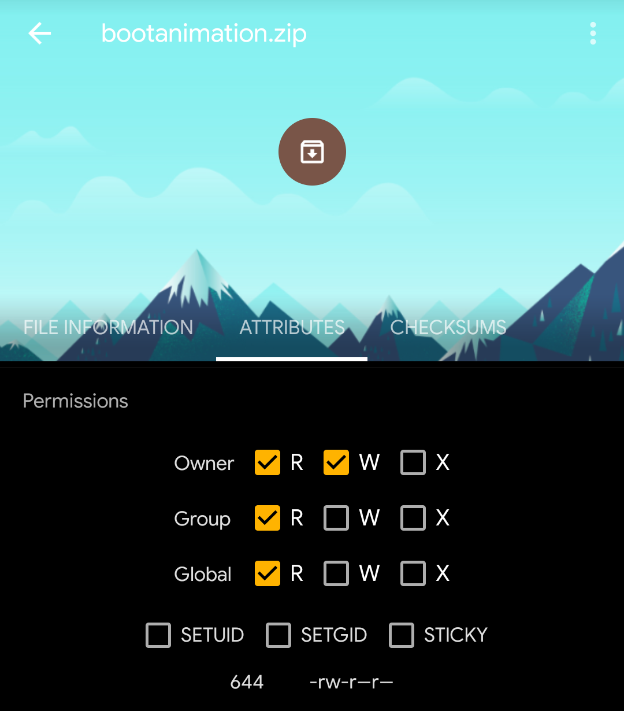

# Google Pixel Monet Themed Bootanimation

## Prerequisites

- Root access on your Android device.

- File manager with root access (Recommended: Solid File Explorer)

## Disclaimer

- Root Access: Rooting your device and modifying system files can void your warranty and may lead to unforeseen issues. Proceed with caution and at your own risk.

- Compatibility: This guide is intended for rooted Android devices. Please note that this guide may not work on Samsung devices or other devices using the ".qmg" format for boot animation files, as they require a different method for changing boot animations. Ensure compatibility with your device before proceeding.

- Use at Your Own Risk: I am not responsible for any damage or malfunction caused to your device as a result of following the instructions provided in this guide. Use the guide at your own risk. However, if the instructions are followed properly, it is guaranteed that the process won't cause any harm to your device.

- Legal: The Google Pixel boot animation files included in this repository are derived from the vendor_aosp repository under the PixelOS organization on GitHub. These files are subject to the Apache License, Version 2.0. Please refer to the LICENSE file for more information.

## Steps to Change Boot Animation

1. Download the Boot Animation Files:

- Navigate to the "bootanimation" folder in this repository and download the appropriate boot animation zip file for your device's screen resolution.

- Choose from the available options: 720p, 1080p, and 1440p. These represent different screen resolutions commonly found on Android devices (720p for HD, 1080p for Full HD, and 1440p for Quad HD). If you're unsure about your device's resolution, you can check your device specifications online or through your device's settings.

3. Rename the Downloaded Zip File:

- Once downloaded, rename the zip file to "bootanimation.zip".

4. Backup the Stock Boot Animation:

- Open Solid File Explorer or any file manager app with root access.

- Find the location of the stock boot animation file on your device. This location may vary depending on the ROM you are using. Common paths include `/system/media` or `/system/product/media`.

- Find the file named "bootanimation.zip" and rename it to "bootanimation.bak". This action will create a backup of your stock boot animation, allowing you to revert to it if needed.

4. Replace the Stock Boot Animation:

- Copy or move the downloaded "bootanimation.zip" file to the same location as the stock boot animation file `(/system/product/media/)`.

- Long-press the copied/moved zip file, then select "Properties".

- In the "Attributes" section, ensure that the permissions match those shown in the provided screenshot below.



5. Reboot: Reboot your device, and enjoy the new Google Pixel boot animation!

## License and Attribution

The Google Pixel boot animation files included in this repository are licensed under the Apache License, Version 2.0. The original copyright and license information for these files are as follows:

```
Copyright 2011-15 The CyanogenMod Project
          2017    The LineageOS Project

Licensed under the Apache License, Version 2.0 (the "License");
you may not use this file except in compliance with the License.
You may obtain a copy of the License at

    http://www.apache.org/licenses/LICENSE-2.0

Unless required by applicable law or agreed to in writing, software
distributed under the License is distributed on an "AS IS" BASIS,
WITHOUT WARRANTIES OR CONDITIONS OF ANY KIND, either express or implied.
See the License for the specific language governing permissions and
limitations under the License.
```
